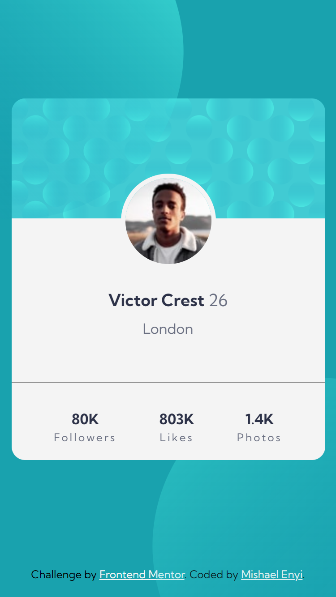
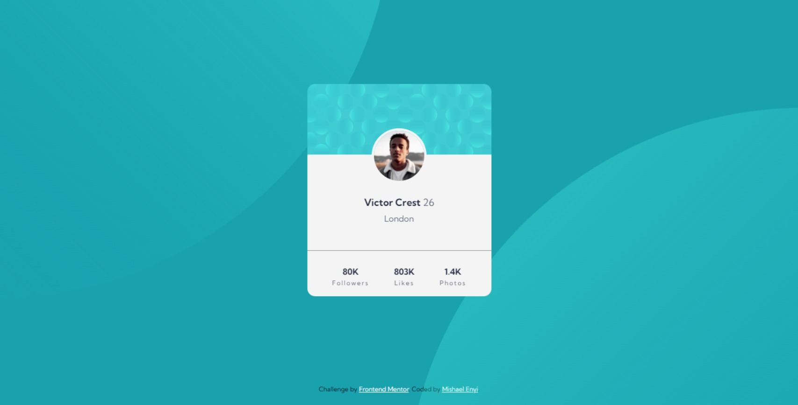

# Frontend Mentor - Profile card component solution

This is a solution to the [Profile card component challenge on Frontend Mentor](https://www.frontendmentor.io/challenges/profile-card-component-cfArpWshJ). Frontend Mentor challenges help you improve your coding skills by building realistic projects. 

## Table of contents

- [Overview](#overview)
  - [The challenge](#the-challenge)
  - [Screenshot](#screenshot)
  - [Links](#links)
- [My process](#my-process)
  - [Built with](#built-with)
  - [What I learned](#what-i-learned)
- [Author](#author)

## Overview

### The challenge

- Build out the project to the designs provided

### Screenshot

### Links

- [Solution URL](https://github.com/mishael-codes/profile-card-component-main)
- [Live site URL](https://mishael-codes.github.io/profile-card-component-main/)

## My process

### Built with

- Semantic HTML5 markup
- CSS custom properties
- Flexbox
- Mobile-first workflow
- [Kumbh Sans Google Font](https://fonts.google.com/specimen/Kumbh+Sans)

### What I learned

Not related to this project but I learnt how to push code to github using the terminal instead of github desktop. And I felt I was faster when doing this because I didn't have to switch applications as I could commit and push directly fro VSCode. It defintely fels rewarding.

## Author
- Website - [Mishael Enyi](https://mishaelenyi.netlify.app)
- Twitter - [@mishael_codes](https://www.twitter.com/mishael_codes)
- Instagram - [@mishael.codes](https://www.instagram.com/mishael.codes)
- Frontend Mentor - [@mishael-codes](https://www.frontendmentor.io/profile/mishael-codes)